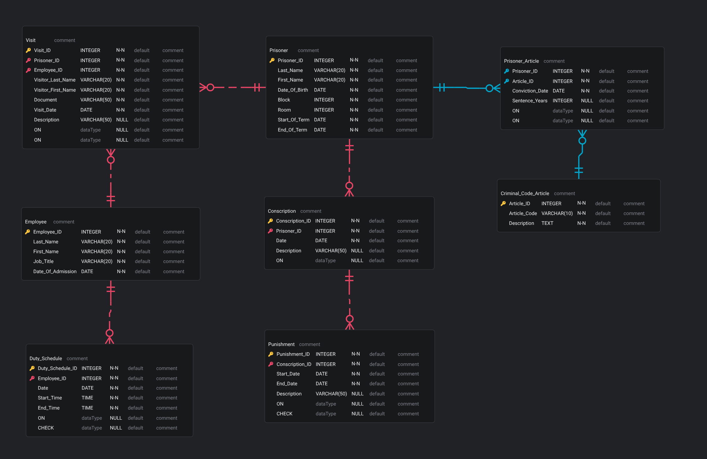

# My Little Prison
[](https://www.mysql.com/)
[](LICENSE)
[](https://github.com/Gitubrr/MyLittlePrison_HW/actions/workflows/build.yaml)

Database for a pet salon

## Database structure


## ERD diagram



## Installation

Create a database and import data
```bash
mysql -u root -p < src/init.sql
```